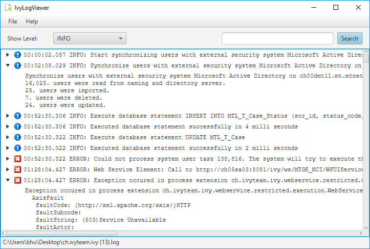

# IvyLogViewer - Beta 

Started as a simple JavaFX test project, but is actually useful as a small and simple log viewer.

## Requirements
* Java 8 with JavaFX (on Linux you need to install `openjfx` in addition to the JDK).
* Maven 3 and later for building.

## Installation
Get a built IvyLogViewer from [releases](https://github.com/ivy-supplements/ivy-log-viewer/releases).

## Build
    mvn clean verify

## Run
    cd target/
    java -jar ivy-log-viewer-X.Y.Z-SNAPSHOT.jar